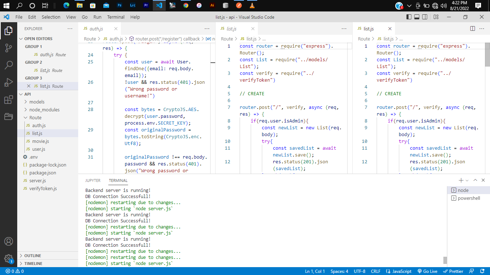
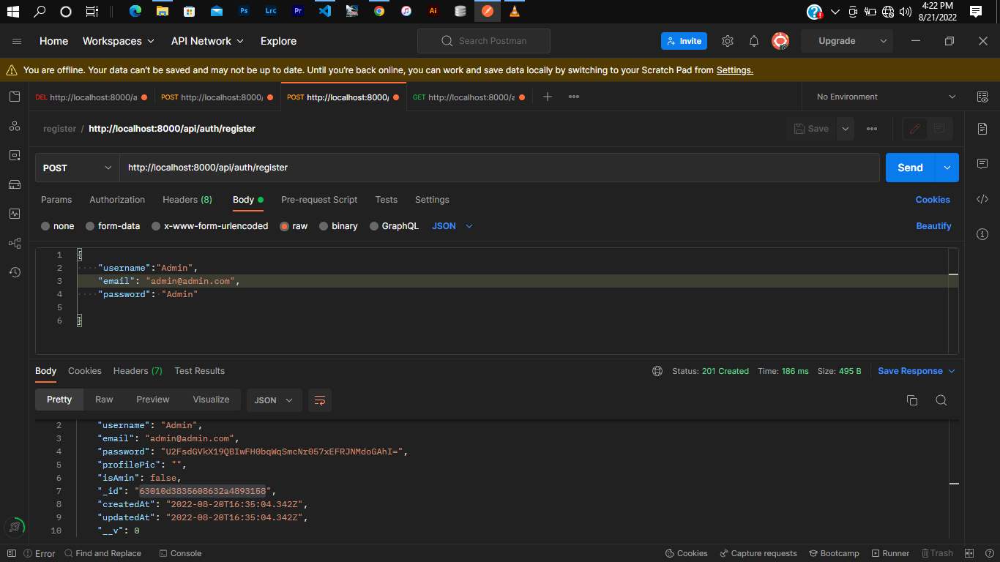
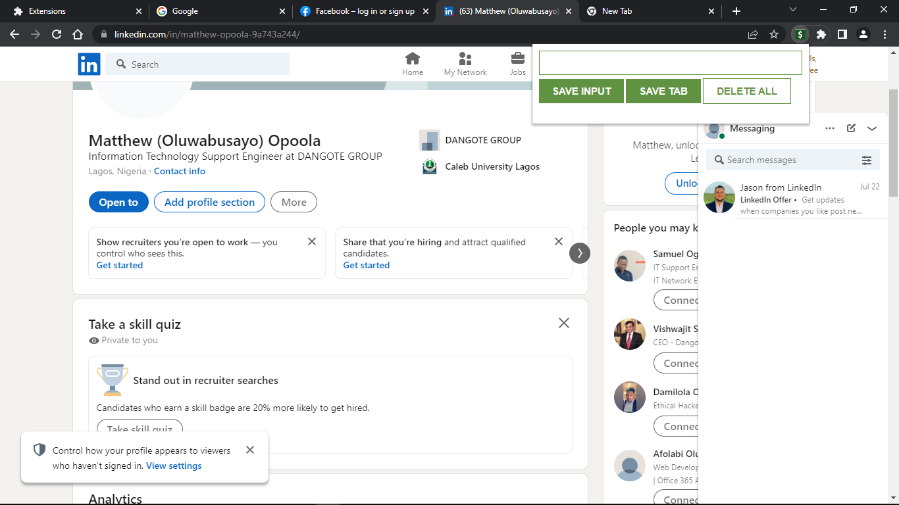

# Movie App Api

This is a movie api with jwt for authentication built with Node js, Express js, MongoDB



## Getting Started

To get this project just clone it and run npm install.

```

## Story

It authenticates users and giving admin privileges to do almost any thing, admin uploads, delete, update and view movies and users qhile the user can view movie and search other users and view limited but enough informations.


$ some more screenshots
```



$ some more screenshots


```

```
